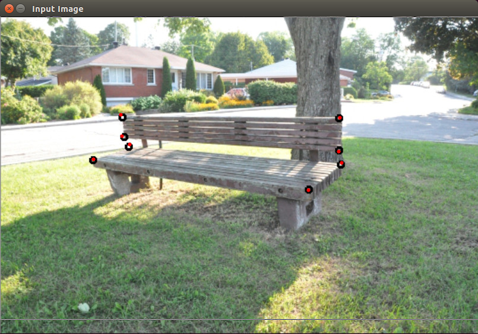
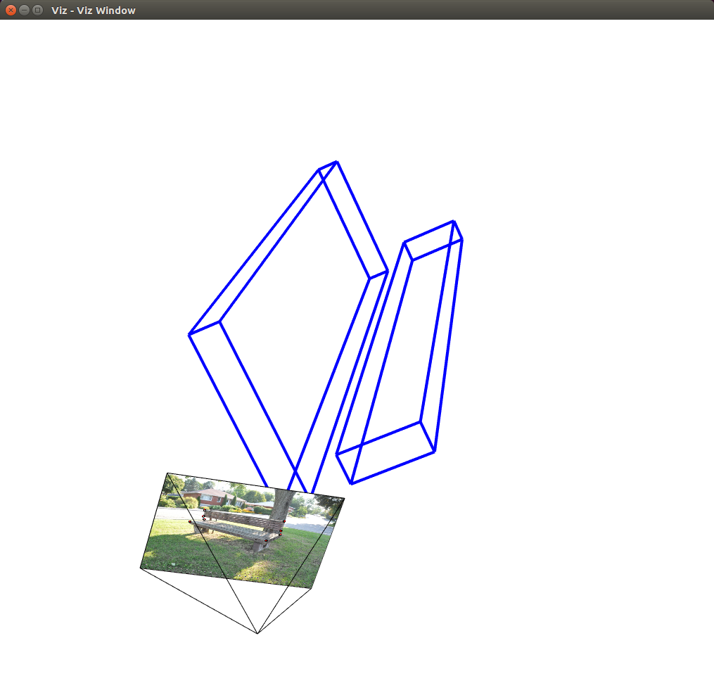

# Pose Estimation
#### This is a toy example about how the pose of a camera is estimated.

## Overview

In Computer Vision, the **pose** of an object typically refers to its
relative orientation and position with respect to a camera. One can
change the pose of an object by either moving the object with respect
to the camera, or the camera with respect to the object. The pose of
the object is typically estimated by analyzing the correspondences
between features extracted from different images -- more than one image looking at the same scene from different angles.

<ul>
<li> 2D-to-2D: See [Hartley and Zisserman, 2000] for the projective transformation/homography and [Nister, 2004] as a seminal work on the visual odometry.
<li> 3D-to-3D: See [Maimone et al., 2007] as an example of such a case.
<li> 3D-to-2D: As pointed out [Nister, 2004], motion estimation from
3D-to-2D correspondences is more accurate than from 3D-to-3D cases
because it minimizes the image reprojection error instead of dealing
with 3D-to-3D feature position error. The sample codes in this repo is
about a solution to the problem of the PnP (Perspective-n-Points). Some well-known PnP solutions are P3P [Gao et
al., 2003], EPnP [Lepetit et al., 2009].
</ul>

## Reference
<ul>

<li>[Cheng et al., 2005] Yang Cheng, Mark Maimone, and Larry Matthies,
<a
href="https://www-robotics.jpl.nasa.gov/publications/Mark_Maimone/smc05_cheng_maimone_matthies.pdf">Visual
odometry on the mars exploration rovers</a>, <i>IEEE Robotics and
Automation Magazine</i>, 13(2): 54-62, 2005.

<li>[Fraundorfer and Scaramuzza, 2012] Friedrich Fraundorfer and
Davide Scaramuzza, <a
href="https://sites.google.com/site/scarabotix/tutorial-on-visual-odometry">Visual
odometry: part II - matching, robustness, and applications</a>,
<i>IEEE Robotics and Automation Magazine</i>, 19(2): , 2012.

<li>[Gao et al., 2003] Xiao-Shan Gao, Xiao-Rong Hou, Jianliang Tang and
Hang-Fei Cheng, <a
href="http://http://www.mmrc.iss.ac.cn/~xgao/paper/ieee.pdf"> omplete
solution classification for the perspective-three-point problem</a>, <i>IEEE Transactions on Pattern Analysis and Machine Intelligence</i>, 25(8): 930-943, 2003.

<li>[Hartley and Zisserman, 2000] Richard Hartley and Andrew
Zisserman, <i>Multiview Geometry</i>, 2000.

<li>[Howard, 2008] Andrew Howard, <a href="
https://pdfs.semanticscholar.org/0a6d/a5191a51c097e4b52153a7b426d79b3d634e.pdf">Real-time
stereo visual odometry for autonomous ground vehicles</a>, In
<i>Proceedings of IEEE/RSJ International Conference on Intelligent
Robots and Systems</i> (IROS-2008), pp. , 2008.

<li>[Lepetit et al., 2009] Vincent Lepetit, Francesc Moreno-Noguer and
Pascal Fua, <a
href="http://http://icwww.epfl.ch/~lepetit/papers/lepetit_ijcv08.pdf">EPnP:
an accurate O(n) solution to the PnP problem</a>, <i>International
Journal of Computer Vision</i>, 2009.

<li>[Maimone et al., 2007] Mark Maimone, Yang Cheng and Larry
Matthies, <a
href="https://www-robotics.jpl.nasa.gov/publications/Mark_Maimone/rob-06-0081.R4.pdf">Two
years of visual odometry on the mars exploration rovers</a>,
<i>Journal of Field Robotics</i>, 24(3): 169-186, 2007.

<li>[Nister, 2004] David Nister, <a
href="http://citeseerx.ist.psu.edu/viewdoc/download?doi=10.1.1.86.8769&rep=rep1&type=pdf">An
efficient solution to the five-point relative pose problem</a>,
<i>IEEE Transactions on Pattern Analysis and Machine Intelligence</i>,
26(6): 756-770, 2004.

<li>[Nister et al., 2004] David Nister, Oleg Naroditsky, and James
Bergen, Visual odometry, In <i>Proceedings of Computer Vision and
Pattern Recognition</i> (CVPR-2004), 2004.

<li>[Nister et al., 2006] David Nister, Oleg Naroditsky, and James
Bergen, <a
href="https://pdfs.semanticscholar.org/c896/5cc5c62a245593dbc679aebdf3338bb945fc.pdf">Visual
odometry for ground vehicle applications</a>, <i>Journal of Field
Robotics</i>, 23(1): 3-20, 2006.

<li>[Rosten and Drummond, 2006] Edward Rosten and Tom Drummond, <a
href="https://www.edwardrosten.com/work/rosten_2006_machine.pdf">Machine
learning for high-speed corner detection</a>, In <i>Proceedings of
European Conference on Computer Vision</i> (ECCV-2006), pp. 430-443,
2006.

<li>[Scaramuzza and Fraundorfer, 2011] Davide Scaramuzza and Friedrich
Fraundorfer, <a
href="https://sites.google.com/site/scarabotix/tutorial-on-visual-odometry">Visual
odometry: part I - the first 30 years and fundamentals</a>, <i>IEEE
Robotics and Automation Magazine</i>, 18(4): , 2011.

<li>[Quan and Lan, 1999] Long Quan and Zhongdan Lan, <a
href="https://hal.archives-ouvertes.fr/inria-00590105/document">Linear
N-point pose determination</a>, <i>IEEE Transactions on Pattern
Analysis and Machine Intelligence</i>, 21(8): 774-780, 1999.

</ul>

## Requirements
To make it run, you need
* OpenCV ver 3.0 or above
* CMake ver 2.8 or above

To enable cv::viz, the VTK package in your OpenCV codes, the following
has to be done: Install VTK and Recompile OpenCV. If you already
installed the VTK and OpenCV properly, and don't have any issues in
calling any built-in functions of cv::viz package, you don't need to
do the followings.

<ol>
<li>Install VTK (Visualization Toolkit):
<ol>

<li> Download <a href="https://www.vtk.org/download/">VTK 7.7.1</a>
**Note** I've tried to do this with VTK 8.1, but it didn't work. So the
following steps only work with VTK 7.7.1 and OpenCV 3.1.0 or 3.3.0.

<li>Unzip VTK-7.1.1.zip

<li>At the directory unzipped VTK-7.1.1, type `ccmake .` This will pop
up cmake GUI. At the menu, do the following:

```bash
BUILD_SHARED_LIBS = ON
BUILD_TESTING = ON
CMAKE_BUILD_TYPE = Release
```

Then press `c` to save the current configuration and exit. You'll have
to push `c` at the beginning to see any of these.

<li>At the directory unzipped VTK-7.1.1, do the following:

```bash
cmake .
make
sudo make install
```

<li> Once you're done with all the above steps, you have VTK shared
libraries and their friends installed on your local machine. Now move
on to the next part, "Re-Compile OpenCV."

</ol>
<li>Re-Compile OpenCV
<ol>

<li>Download <a href="https://opencv.org/releases.html">OpenCV
3.3.0</a> and unzip it.

<li>At the directory unziped OpenCV, do the following:

```bash
mkdir build

cd build

cmake -D CMAKE_BUILD_TYPE=RELEASE -D CMAKE_INSTALL_PREFIX=/usr/local -D BUILD_PYTHON_SUPPORT=ON -D BUILD_EXAMPLES=ON –D WITH_VTK=ON ..

make

sudo make install
```
</ol>
</ol>

## Build
Now you have all the required libraries. It's time to build the repo.
To build, do the following at the directory you cloned this repo:

```bash
mkdir build
cd build
cmake ..
make
```

## Run the Executable

After compilation, in the build directly, type the following:

```bash
cd build
./pe
```

## Results



